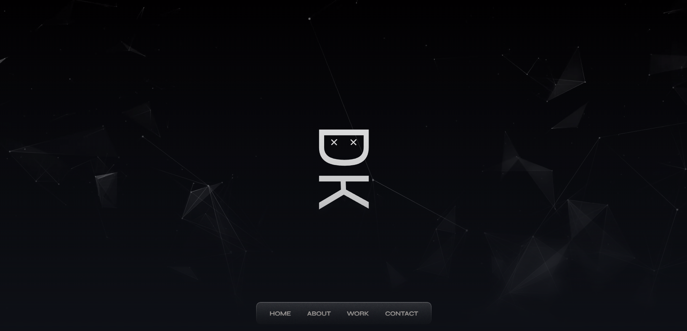
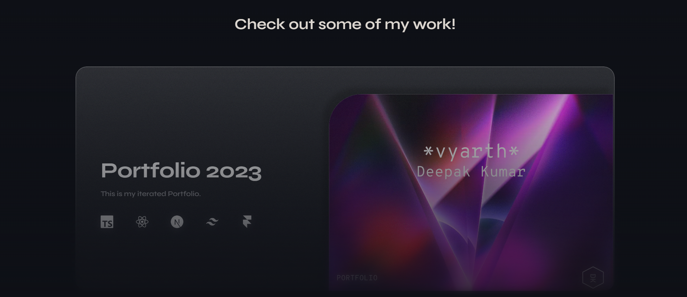
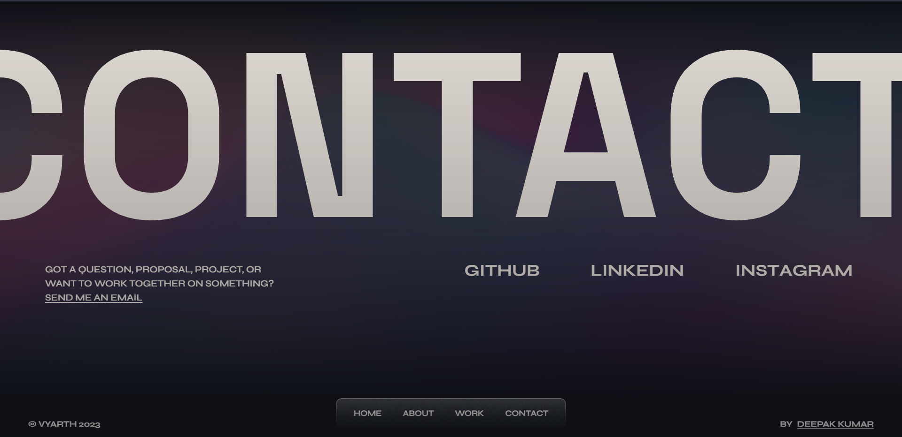

<<<<<<< HEAD
# Portfolio

This is  my portfolio website. It is built with Next.js, React and Tailwind CSS.
=======
# Portfolio 

This is my portfolio website. It is built with Next.js, React and Tailwind CSS.
>>>>>>> 36d79a91c5aa24820ace9caed507e3feaabd9e95

Check it out [here](https://deepakkumar-portfolio.vercel.app/)

---

## Showcase

    
     
    
     
    

<<<<<<< HEAD
=======
---

>>>>>>> 36d79a91c5aa24820ace9caed507e3feaabd9e95

## Tech used 🛠️

- [Next.js](https://nextjs.org/) - Bundler
- [React](https://reactjs.org/) - UI Library
- [Tailwind CSS](https://tailwindcss.com/) - CSS Framework
- [Framer Motion](https://www.framer.com/motion/) - Animation Library
- [GSAP](https://greensock.com/gsap/) - Animation Library
- [ESLint](https://eslint.org/) - Linter
- [Prettier](https://prettier.io/) - Code Formatter
- [Blobity](https://blobity.dev/) - Cursor Effects
- [usehooks-ts](https://usehooks-ts.com/) - Custom React Hooks

---

## License 📄

This project is licensed under the GNU GPLv3 License - see the [LICENSE](LICENSE) file for details.

---

## Goodbye 👋

If you liked this project, please consider giving it a ⭐!
